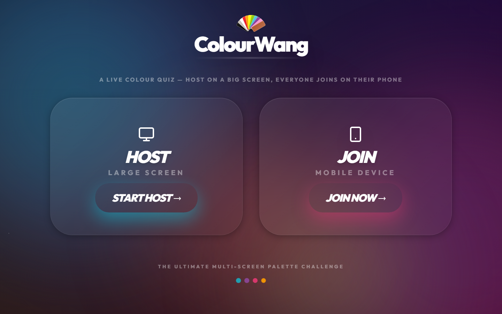
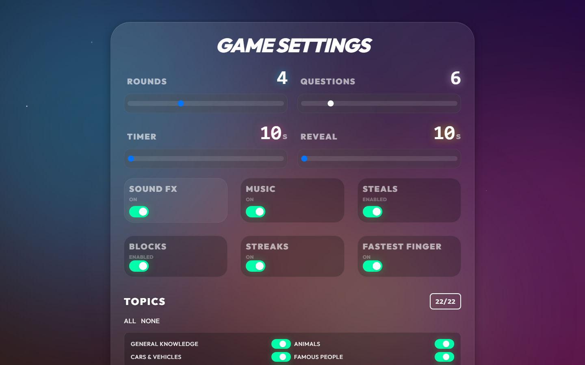
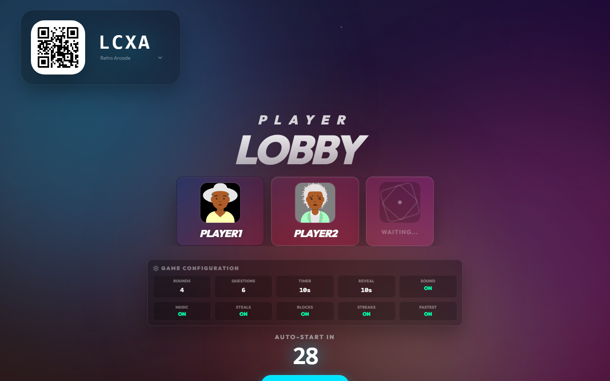
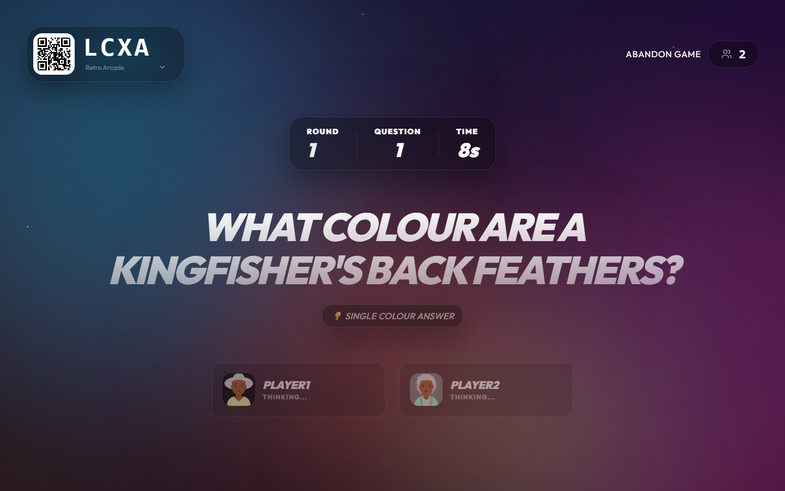
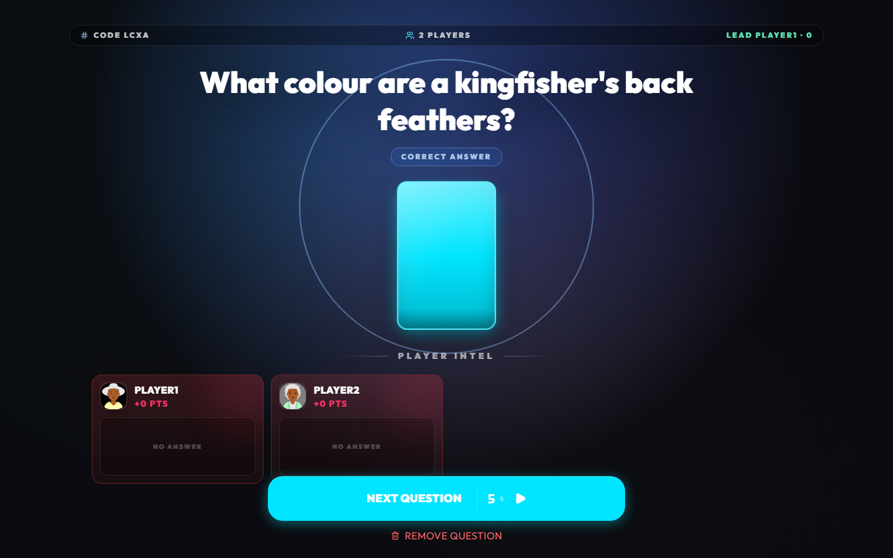
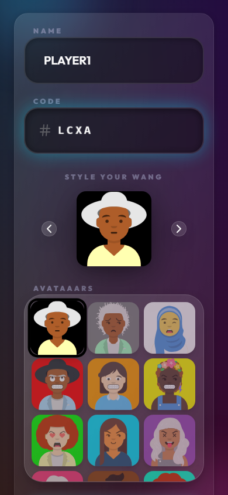
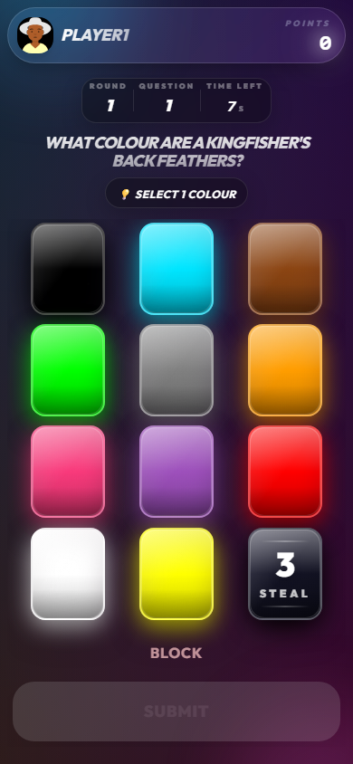
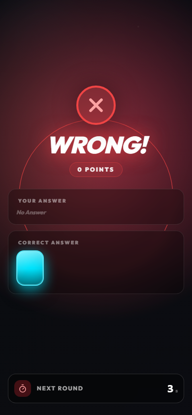

# ColourWang

> A live colour quiz — host on a big screen, everyone joins on their phone.

Real-time multiplayer party game. The host runs the game on a large screen; players join from their phones using a room code or QR code and tap colour cards to answer.



## How It Works

| Step | Host (big screen) | Players (mobile) |
|------|-------------------|-----------------|
| 1 | Configure game settings — rounds, timer, topics, jokers | — |
| 2 | Initialise lobby — share the room code or QR | Enter name, pick avatar, enter code |
| 3 | Start the game | Wait in lobby |
| 4 | Question shown with live timer | Tap a colour card to answer |
| 5 | Correct answer revealed with scores | See result + points |
| 6 | Repeat until final scores | — |

### Host screens

| Game settings | Lobby (players joined) | Question in progress | Result reveal |
|---|---|---|---|
|  |  |  |  |

### Player screens (mobile)

| Join | Colour cards | Result |
|---|---|---|
|  |  |  |

## Quick Start

```bash
git clone https://github.com/garpunkal/ColourWang.git
cd ColourWang
npm run install:all
npm run dev
```

- **Host screen:** `https://localhost:5173`
- **Server:** `https://localhost:3001`

> The client generates local HTTPS certs on first run. Start the client at least once before the server so the certs exist.

## Tech Stack

| Layer | Technologies |
|-------|-------------|
| Frontend | React 19, Vite, TypeScript, Tailwind CSS, Framer Motion |
| Backend | Node.js, Express, Socket.IO, TypeScript |
| Testing | Playwright (E2E) |
| Tooling | ESLint, Nodemon, Concurrently |

## Gameplay Events

When jokers are enabled, players get special action cards:

- **STEAL** — removes a random set of colour cards from another player.
- **BLOCK** — prevents a chosen player from answering the current question.

## Project Structure

```
ColourWang/
├── client/          # React/Vite frontend
├── server/          # Express/Socket.IO backend
├── config/          # Shared game & content configuration (single source of truth)
├── docs/            # Extended documentation & screenshots
├── certs/           # Local HTTPS certificates (gitignored)
├── docker-compose.yml
└── package.json     # Root orchestration scripts
```

## Documentation

| Guide | Contents |
|-------|----------|
| [Development](docs/DEVELOPMENT.md) | Local setup, HTTPS, scripts, testing, troubleshooting |
| [Deployment](docs/DEPLOYMENT.md) | Docker, Nginx, production config, security |
| [Configuration](config/README.md) | All config files explained with examples |

## License

MIT
